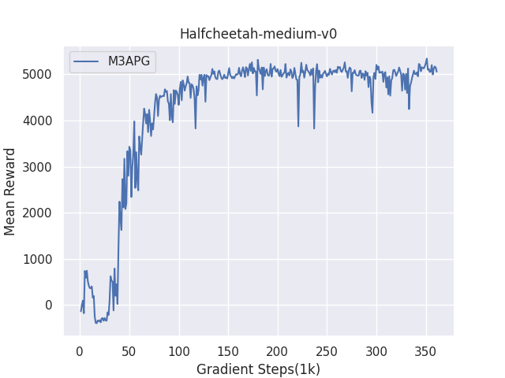
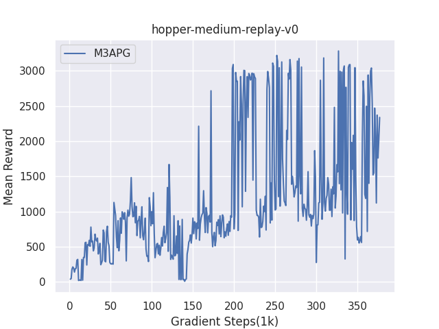

# offline-MBPO
This repository contains the code of a version of model-based RL algorithm MBPO, which is modified to perform in offline RL settings\
Paper:[When to trust your model: Model-based policy optimization](https://arxiv.org/pdf/1906.08253)\
With much thanks, this code is based on [Xingyu-Lin](https://github.com/Xingyu-Lin/mbpo_pytorch)'s easy-to-read pytorch implementation of MBPO
# Requirements
See [requirements.txt](https://github.com/LxzGordon/offline-mbpo/blob/main/requirements.txt)\
The code depends on [D4RL](https://github.com/rail-berkeley/d4rl)'s environments and datasets\
Only support hopper, walker, halfcheetah and ant environments right now (if you wish to evaluate in other environments, modify the termination function in [predict_env.py](https://github.com/LxzGordon/offline-mbpo/blob/main/predict_env.py))
# Usage
Simply run
```shell 
  
python main_mbpo.py --env_name=halfcheetah-medium-v0 --seed=1234
  
```
Or modify the script [runalgo.sh](https://github.com/LxzGordon/offline-mbpo/blob/main/runalgo.sh), then
```shell
  
bash runalgo.sh
  
```
#Results
<div align=left>
<div align=right>
